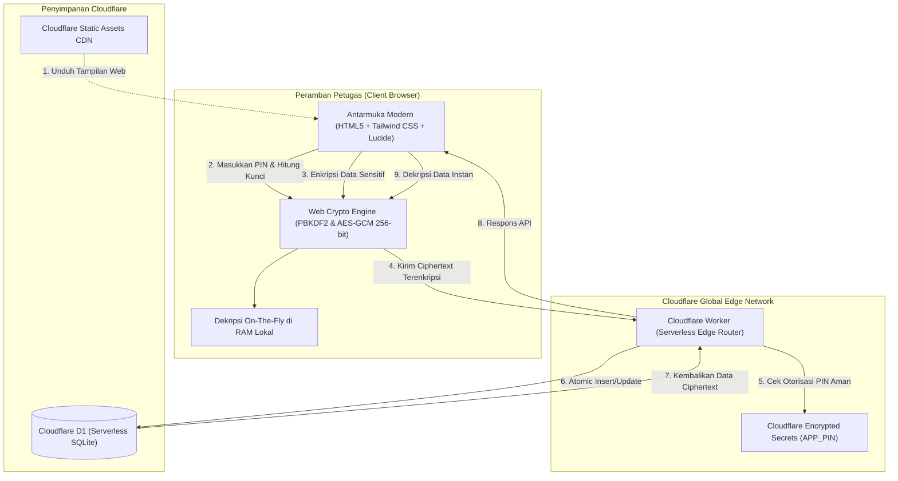

# 🔥 Sistem Register Agenda Surat Keluar
### *"Buang kertasmu, pakai teknologi! Ayo jadi kelurahan & kecamatan yang maju!"*

[](https://github.com/dandsay/nosurat-keluar)
[](https://workers.cloudflare.com/)
[]()
[]()

---

## 📢 Suara Hati Staf Kelurahan: Woy, Berbenah!

> *"Udah tahun 2026, era AI udah di mana-mana, kok kita di kantor kelurahan masih sibuk nyatet nomor surat pakai bolpoin di buku agenda tebal berdebu? Giliran pimpinan nanya berkas tahun lalu, pada bingung garuk-garuk kepala karena bukunya nyelip atau catatannya ketumpahan kopi!"*

Jujur aja, **gue juga cuma staf biasa di kantor kelurahan**. Bukan pejabat eselon, bukan konsultan IT mahal. Tapi gue punya keresahan yang sama kayak banyak temen-temen staf di kelurahan, desa, dan kecamatan se-Indonesia: **kenapa birokrasi kita lambat dan ribet sendiri sama tumpukan kertas?**

Sering banget kejadian di kantor:
- **Nomor Dobel:** Dua orang staf bikin surat keluar di saat bersamaan, ujung-ujungnya nomor suratnya tabrakan.
- **Kekacauan Nomor Mundur:** Ada surat mendesak tanggal kemarin yang harus disusulkan, akhirnya buku agenda dicoret-coret sampai kayak ceker ayam.
- **Spreadsheet Rusak:** Mau coba modern pakai Excel/Spreadsheet, eh rumusnya kepencet hapus sama temen kerja, atau barisnya keacak-acak pas diedit barengan.
- **Cari Arsip Setengah Mati:** Warga atau dinas butuh klarifikasi surat 6 bulan lalu, kita harus ngubek-ngubek lemari arsip berjam-jam.

**Gue pengen kelurahan tuh maju!** Kelurahan dan desa itu garda terdepan pelayanan warga. Kalau urusan nomor surat aja masih manual dan bikin pusing, gimana mau ngasih pelayanan prima? 

Maka dari itu, lahirlah **Sistem Register Agenda Surat Keluar** ini. Dibangun dari pengalaman nyata di lapangan, dirancang agar **bebas biaya server (Zero-Cost)**, super aman dengan enkripsi standar militer (**Zero-Knowledge**), dan yang paling penting: **bisa dipakai siapa saja secara gratis (Open Source)**.

Yuk bisa yuk! Kelurahan, desa, dan kecamatan di seluruh Indonesia bisa lebih maju dan tertib administrasi! 🚀

---

## ⚡ Kenapa Aplikasi Ini Solutif Banget?

### 1. 💰 Nol Rupiah (Zero Server Cost)
Gak perlu ngajuin anggaran server puluhan juta rupiah ke dinas. Aplikasi ini berjalan 100% di **Cloudflare Workers & D1 (Serverless SQLite)** paket gratis (*Free Tier*). Kapasitas paket gratisnya sudah lebih dari cukup untuk menampung ribuan surat keluar setiap tahunnya!

### 2. 🔒 Privasi Total: Zero-Knowledge Client-Side Encryption
Data pemerintahan itu rahasia. Dengan arsitektur **Zero-Knowledge (AES-GCM 256-bit + PBKDF2)**:
- Perihal surat, kode klasifikasi, instansi tujuan, dan nama staf dienkripsi langsung di browser petugas sebelum data terbang ke internet.
- Database Cloudflare D1 **hanya menyimpan huruf acak (ciphertext)**. Pihak penyedia server Cloudflare sekalipun tidak bisa membaca isi surat kita.
- Kunci enkripsi dibuat dari PIN otorisasi yang dipegang staf sendiri di memorinya.

### 3. ⏱️ Anti-Nomor Ganda & Super Cepat (Atomic Safe)
Gak ada lagi drama nomor kembar! Sistem penomoran otomatisnya berjalan secara *atomic transaction* di SQLite Edge (<50 milidetik). Meskipun 5 petugas memencet tombol "Terbitkan" di detik yang persis sama, masing-masing akan mendapatkan nomor urut yang pasti berbeda dan urut.

### 4. 📅 Solusi Nomor Mundur yang Tertib & Terkunci
Butuh nomor susulan tanggal lampau? Ada fitur **+ Mundur**:
- Tombol hanya muncul di nomor urut terakhir pada tanggal yang bersangkutan (anti manipulasi liar).
- Format penomoran bertingkat rapi: `400.1`, `400.2`, dst., dan langsung mengelompok di bawah surat induknya.
- Tanggal surat dan kirim otomatis terkunci mengikuti induk.

### 5. 🛡️ Jaring Pengaman Human-Error
- **Logika Kronologis:** Sistem akan menolak jika tanggal surat dibuat lebih maju daripada tanggal kirim fisik/elektronik.
- **Proteksi Akhir Pekan:** Mencegah penerbitan surat pada hari Sabtu/Minggu demi tertib administrasi kantor pemerintah.
- **Proteksi Edit Anti-Backdate:** Tanggal pada surat yang diedit tidak bisa dimundurkan sembarangan di luar batas wajar.
- **Konfirmasi Hapus Cerdas:** Untuk menghapus surat, petugas wajib mengetikkan persis nama pembuatnya, mencegah data terhapus tak sengaja.

### 6. 🔍 Pencarian Pintar (Bisa Ketik Nama Bulan!)
Mencari arsip lama gak sampai 1 detik:
- Bisa cari nomor, perihal, instansi tujuan, atau nama petugas.
- **Mendukung nama bulan fleksibel:** Cukup ketik `agus`, langsung keluar semua surat bulan Agustus; ketik `des`, langsung muncul berkas bulan Desember.

### 7. 🕒 Audit Trail Realtime Petugas
Setiap surat yang diterbitkan otomatis mencatat **timestamp realtime** (jam dan menit pengerjaan) petugas yang bertanggung jawab. Tertib, transparan, dan akuntabel saat ada pengawasan internal.

### 8. 📱 Nyaman Dipakai di HP (Thumb-Friendly UI)
Bekerja di kantor kelurahan sering kali menuntut petugas berada di lapangan atau rapat luar. Tampilan didesain responsif menggunakan Tailwind CSS dengan antarmuka kartu mobile dan *bottom-sheet* yang gampang diakses cukup dengan jempol satu tangan.

---

## 📐 Arsitektur Sistem



---

## 📁 Struktur Direktori

```
nosurat-keluar/
├── public/                       # Frontend Single Page Application
│   ├── index.html                # Halaman Web Portal, Modal Dialog & Bottom Sheet
│   ├── img/                      # Aset Logo & Gambar
│   └── js/                       # Skrip JavaScript Modular
│       ├── crypto.js             # Enkripsi & Dekripsi AES-GCM 256-bit + PBKDF2
│       ├── auth.js               # Manajemen Sesi & Verifikasi PIN Tanpa Bocor Format
│       ├── agenda.js             # Form Penerbitan Agenda Reguler
│       ├── table.js              # Tabel Terpadu, Search Bulan, Bottom Sheet & Hapus
│       ├── stats.js              # Perhitungan Statistik Dinamis Klien
│       └── export.js             # Fitur Ekspor Data ke Excel/CSV
├── src/                          # Backend Cloudflare Worker (Edge API)
│   ├── index.js                  # Entry Point Router & Static Assets
│   ├── routes/
│   │   ├── auth.js               # Endpoint Autentikasi PIN + Anti-Bruteforce Delay
│   │   ├── agenda.js             # Endpoint CRUD & Penomoran Atomic
│   │   ├── mundur.js             # Endpoint Verifikasi & Sub-Nomor Surat Mundur
│   │   └── stats.js              # Endpoint Agregat
│   └── utils/
│       └── response.js           # Format Standar JSON Response & Security Headers
├── schema.sql                    # Skema DDL Database SQLite D1
├── wrangler.jsonc                # Konfigurasi Cloudflare Workers & Binding D1
├── package.json                  # Dependensi NPM & Script Perintah
└── .gitignore                    # Berkas Pengecualian Git (.dev.vars, types)
```

---

## 🚀 Panduan Pasang Mandiri (Step by Step)

Siapa pun bisa memasang aplikasi ini untuk kelurahan/instansinya sendiri dalam waktu kurang dari 10 menit:

### 1. Persiapan Alat
- Pasang [Node.js](https://nodejs.org/) (versi 18 atau lebih baru).
- Punya akun [Cloudflare](https://dash.cloudflare.com/) (gratis, cukup daftar pakai email).

### 2. Kloning Repositori & Install
```bash
git clone https://github.com/dandsay/nosurat-keluar.git
cd nosurat-keluar
npm install
```

### 3. Buat Database Cloudflare D1
Jalankan perintah ini di terminal:
```bash
npx wrangler d1 create agenda-surat-db
```
Wrangler akan memberikan output seperti ini:
```jsonc
[[d1_databases]]
binding = "DB"
database_name = "agenda-surat-db"
database_id = "xxxxxxxx-xxxx-xxxx-xxxx-xxxxxxxxxxxx"
```
Salin nilai `database_id` tersebut ke dalam file `wrangler.jsonc` pada baris `"database_id"`.

### 4. Tentukan PIN Keamanan Anda
Masukkan PIN rahasia kelurahan/kantor Anda menggunakan Cloudflare Secrets:
```bash
npx wrangler secret put APP_PIN
```
*(Ketikkan PIN rahasia pilihan Anda saat diminta)*

Untuk coba-coba di laptop/komputer sendiri, buat file `.dev.vars` (file ini otomatis tidak ter-upload ke Git):
```ini
APP_PIN="PIN_RAHASIA_ANDA"
```

### 5. Buat Tabel Database
- **Untuk di Komputer Lokal:**
  ```bash
  npm run d1:local
  ```
- **Untuk di Server Cloudflare (Produksi):**
  ```bash
  npm run d1:remote
  ```

### 6. Coba di Komputer Lokal
```bash
npm run dev
```
Buka browser di `http://localhost:8787`. Masukkan PIN Anda dan aplikasi siap dipakai!

### 7. Publikasikan ke Internet (Deploy)
```bash
npm run deploy
```
Dalam hitungan detik, aplikasi agenda surat Anda sudah online secara global di domain Cloudflare Workers Anda sendiri!

---

## 🤝 Mari Majukan Kelurahan & Desa Kita Bareng-Bareng!

Proyek ini dibuat dengan cinta dan dedikasi oleh staf kelurahan yang bermimpi melihat birokrasi pemerintahan daerah di Indonesia menjadi lebih rapi, modern, dan manusiawi.

- Punya ide fitur baru?
- Menemukan kendala saat pasang di kantor Anda?
- Ingin menambahkan format nomor surat khas daerah Anda?

Silakan buka **[Issue](https://github.com/dandsay/nosurat-keluar/issues)** atau kirimkan **Pull Request**. Repositori ini milik bersama untuk kemajuan instansi pelayanan publik di seluruh Indonesia.

**Maju terus Kelurahan & Desa Indonesia! Buang kertasmu, manfaatkan teknologi!** 🇮🇩
